# Introduction

This lab is about attacking a firewall-protected site from the perspective of a hacker. Particularly, the lab will focus on the concentrated attack method and how it is done through means of social engineering and reverse social engineering.

# Hands-On Demonstration

## Targeted Social Engineering Attack

### Display whois.net results for Global Enterprises

This step uses whois.net to view the contact info for the target website, Global Enterprises. This is part of a series of steps taken in order to ensure that the attacker has the right target.

  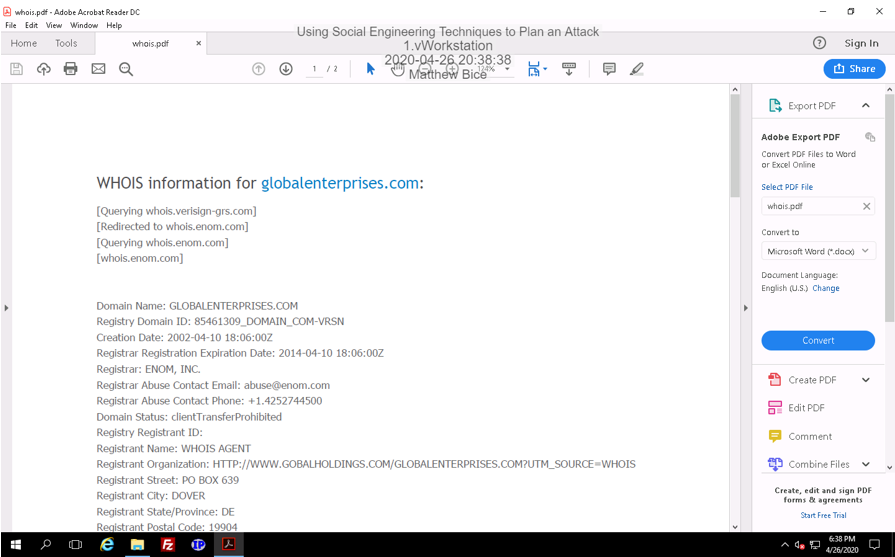

### Find the profile of potential social engineering target

To get closer to the company, I find the profiles of several Global Enterprise employees on a business networking site. After reviewing several of the employees, I have determined that LouAnn Garfinkle is the best target because of her position, her previous occupation, and her unique name.

  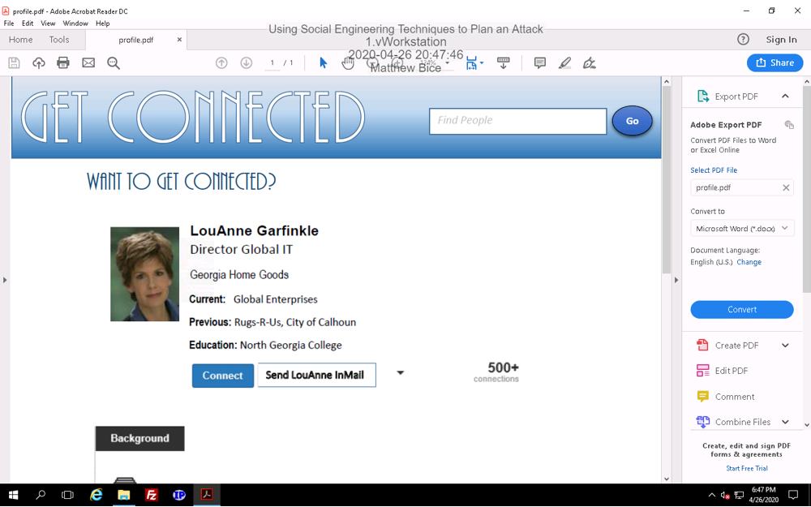

### View information on LouAnne's blog

LouAnne’s profile stated that she has a blog she uses to discuss IT topics. The screenshot below shows a post she made about firewalls that could potentially be useful. She is careful not to state her employer on her blog, but we can infer that the practices she is discussing pertain to Global Enterprises.

  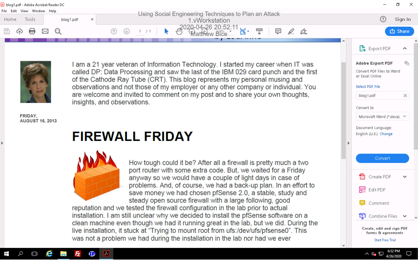

### View more information on LouAnne's blog

LouAnne has a second blog post talking about how her workplace has a bring your own device policy and that support and security have been a nightmare. Knowing this could be useful for attack purposes.

### View release information for firewall

Although we now know what firewall Global Enterprises is using, it is possible that they have upgraded the software to a newer release. A quick search on pfSense’s website reveals that there are indeed versions after 2.0. The most recent version appears to be 2.5.0.

  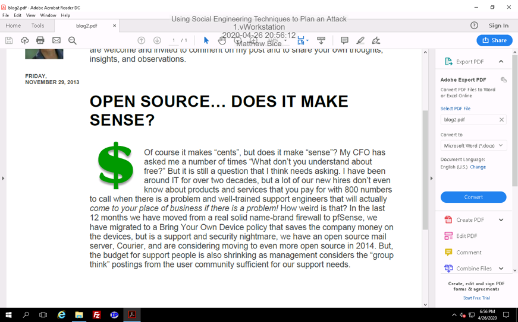

# Applied Learning

In this next section, we switch targets. We now want to launch a social engineering attack on Corporation Techs, but also get burned while playing with fire.

## Targeted Social Engineering Research

### Display services of Corporation Techs

This screenshot shows the services that are offered by Corporation Techs. They have an active call center that could potentially be exploited for information.

  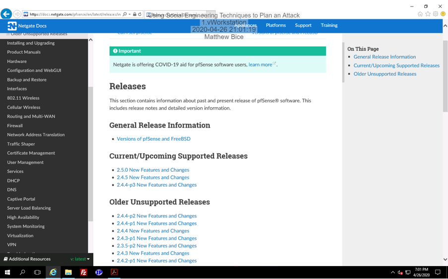

### Identify the corporate officers of Corporate Techs

This panel of the website shows the main officers in charge of Corporation Techs. Displaying their names and their sector of work will be useful in deciding who to target.

  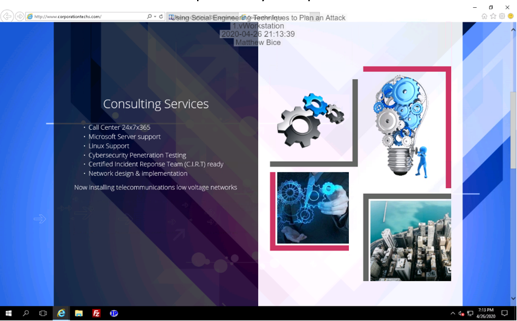

### Gather information about the officers using their LinkedIn profiles

Andrew Symonds:
-	Bachelor of Commerce from San Diego State University; years attended unknown
-	Lives in Addison, Texas
-	Worked the longest at Wodash Incorporated as a sales executive for thirteen years and eleven months

Mike Hutchins:
-	Bachelor’s in computer and information systems security/information assurance from Virginia Tech; attended from 1992 to 1996
-	Lives in Addison, Texas
-	Worked the longest at Aegis Secured as a security officer for seven years and four months

Dee Dasher:
-	Bachelor’s in computer science from Texas State University; attended from 1985 to 1989
-	Lives in Addison, Texas
-	Worked the longest at Dante’s Inc under operations for eight years and seven months

### Display search results using Google's search operators

This screenshot shows the search results that appear after using Google’s allintext search operator for Andrew Symonds and site for LinkedIn. Information is only shown if it appears in LinkedIn and mentions Andrew Symonds.

  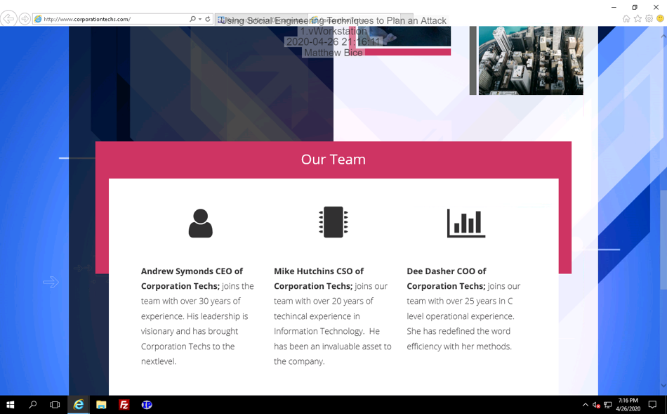

### Repeat the search with refined results and quotation operator

The results are now more accurate due to consistently searching for things relevant to my target. The quotation operator has also been implemented to find anything having to do with security.

  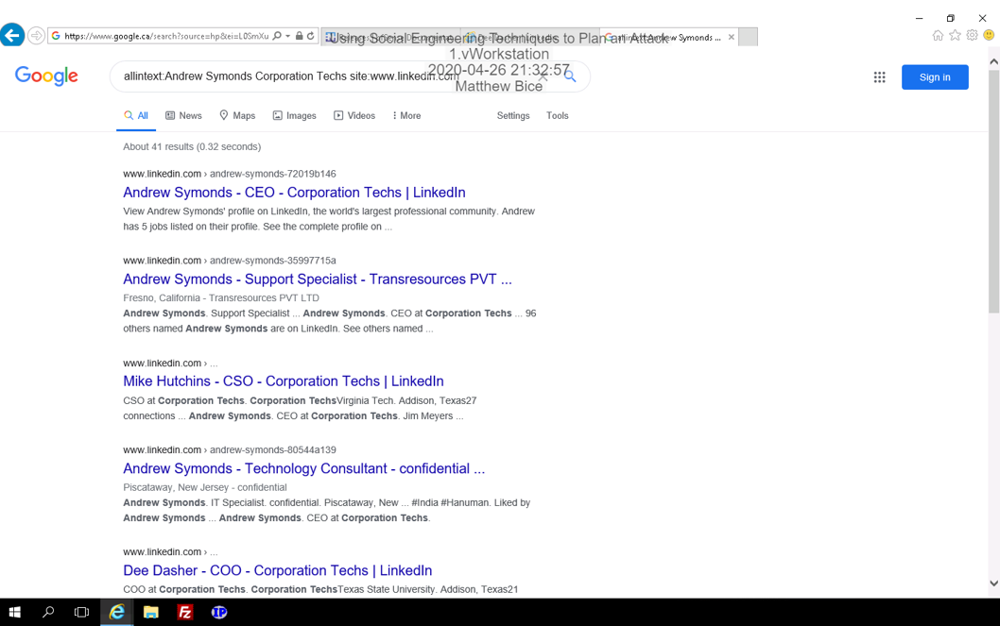

### Show confirmation email

This screenshot is of the conformation email I received after sending a contact request.

  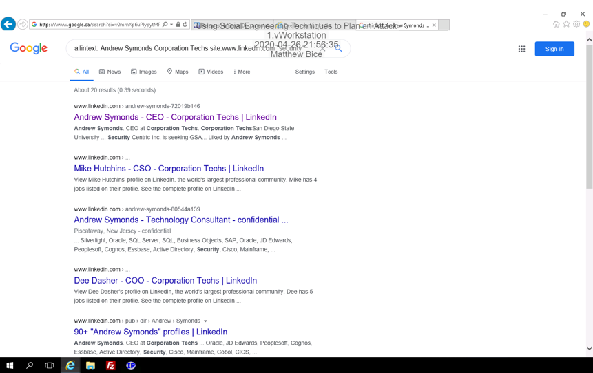

### Get phished :(

Despite my intention to phish this corporation, they were trying to phish me the whole time.

  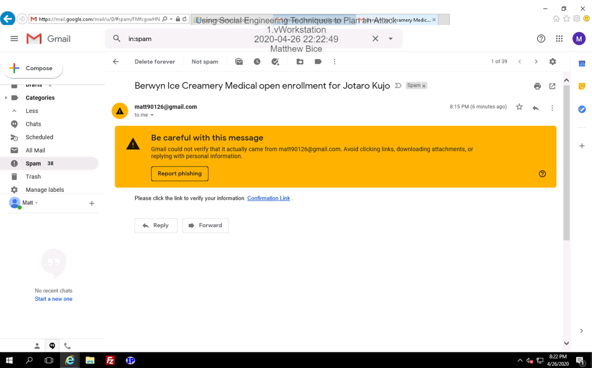

## Identify an Attack

### Display results of Nmap scan

This screenshot shows the command prompt after an Nmap scan was run on Corporation Tech’s website. The results show that port 80 is open and the web server is an Apache server. Nothing suspicious is found, but it may be worth noting that port 80 serves HTTP and is notoriously unsecure.

  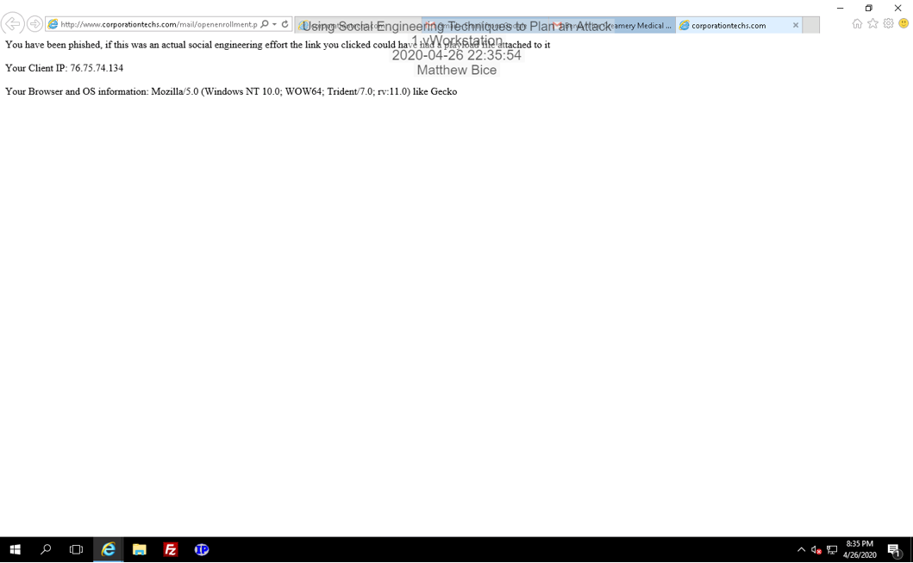

### Display whois information for suspicious IP

In this part of the lab, I used IPNetInfo to take an IP making a suspicious number of requests and resolve it into whois data. The screenshot below shows this data.

  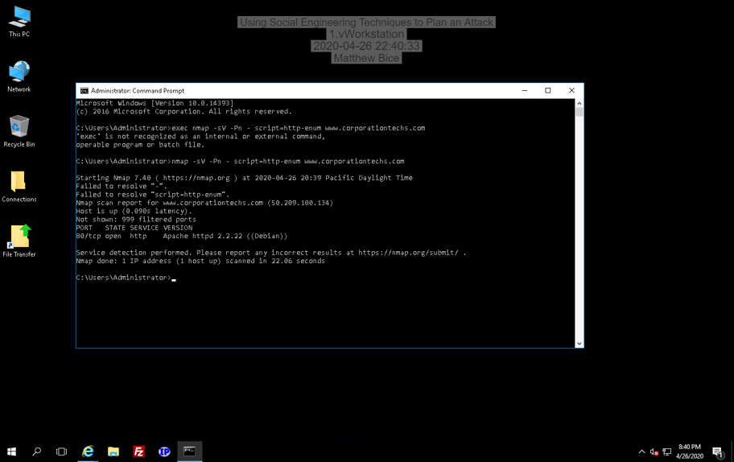

### Find pricesheet.xlsx

This screenshot shows the search results when attempting to find the pricesheet.xlsx sheet. It does not explicitly appear in the results,  but there is a sheet with a very similar name (pricecheat).

  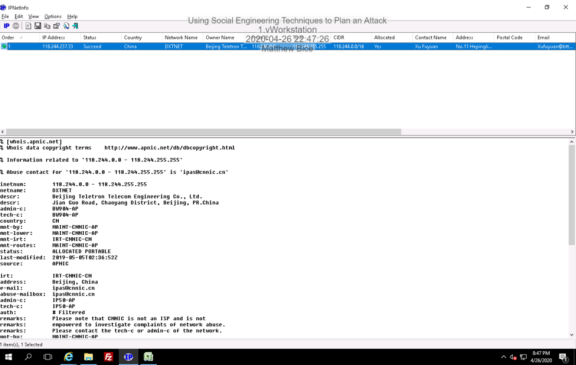

### Identify the script that opens pricecheat.pdf

Returning to Corporation Tech’s homepage, I used inspect element in the debugger panel to find the script that opens the leaked file.

  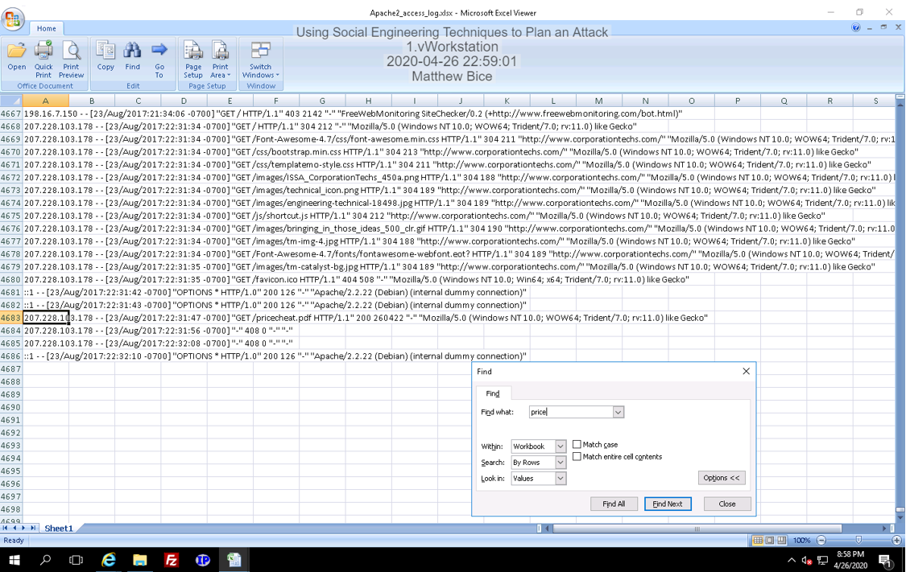

### Document actions taken to open the file

The script tells the user to press alt + s. Doing so opens the price sheet. There is also another script for pressing ctrl + enter. However, this one leads to an invalid page.

### Show results of script

This screenshot shows the page that appears when ctrl + s is pressed.

  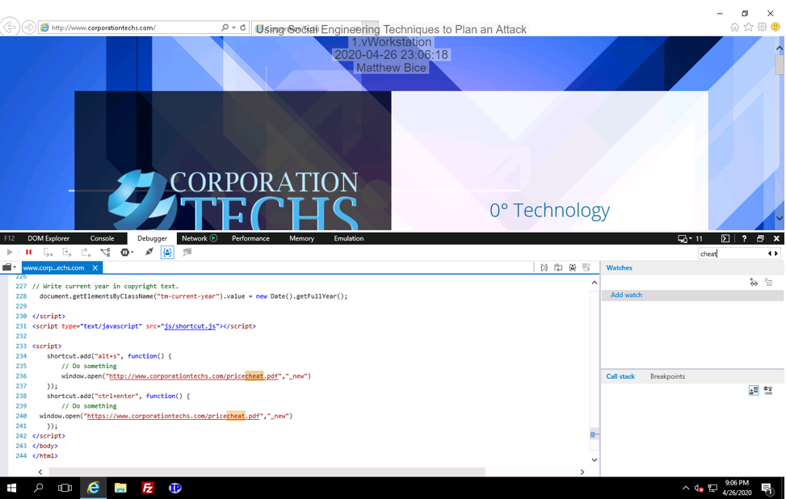

# Analysis and Discussion

Hackers perform reconnaissance on individuals before they attack because they want to find the most suitable target for social engineering. For instance, in section one, I had to look through several employee profiles until I found the best one. Although there were other potential candidates, the one closer to the bottom of the list showed to most promising results. Moreover, reconnaissance is done on these individuals so that the hacker knows how to social engineer them. Looking up their hobbies, families, affiliations, and so forth is a good way to come up with a phishing email.

